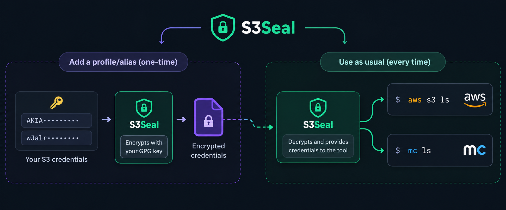

# s3seal

`s3seal` keeps S3 credentials for `mc` and `aws` encrypted with GPG, instead of
plaintext in `~/.mc/config.json` and `~/.aws/credentials`.

You keep using `mc` and `aws` as usual. `s3seal` turns sealing on or off for
each client and moves its credentials between plaintext and encrypted storage.

<p align="center">
  
</p>

## Install

```bash
curl -fsSL https://raw.githubusercontent.com/mhbahmani/s3seal/master/install.sh | bash
```

The installer asks which clients to protect and where to install. Press Enter
to accept the default, `~/.local/share/s3seal`. Everything goes in that folder:
the program files, and a `bin` folder holding the commands. If an official
client is on your `PATH`, it asks before moving it out of the way, so that
`s3seal` can use the name.

Add the `bin` folder to your `PATH` once. The installer prints the line:

```bash
export PATH="$HOME/.local/share/s3seal/bin:$PATH"
```

Requirements: `bash`, `gpg`, `curl`. Each client you protect needs its own
official binary (`mc` or `aws`).

Running the installer again is safe.

## Protecting a client

```bash
s3seal enable mc      # link the mc wrapper, then offer to migrate its credentials
s3seal enable aws     # same for the AWS CLI
s3seal status         # shows sealed and plaintext credentials
s3seal disable mc     # unlink, then offer to restore plaintext credentials
s3seal disable aws
```

`enable` and `disable` ask before moving any credentials. Answer `n` and they
print the manual steps and the command to run later. Use `--yes` to migrate
without asking, or `--no-migrate` to skip the migration.

To migrate later:

```bash
s3seal migrate mc              # encrypt plaintext credentials
s3seal migrate mc --to plain   # write sealed credentials back as plaintext
```

Migration works the same way for every client. Each client uses its own store.

## Using mc and aws

After `s3seal enable`, you keep using `mc` and `aws` as before:

```bash
mc alias set prod https://minio.example.com   # keys are stored encrypted
mc ls prod/bucket
aws configure --profile prod                  # keys are stored encrypted
aws --profile prod s3 ls
```

For `aws`, each sealed profile's keys are fetched on demand through
`credential_process`. For `mc`, the wrapper decrypts only the aliases a command
uses.

Profiles with temporary session tokens and SSO profiles are not sealed.

## Upgrade and uninstall

```bash
s3seal upgrade --check   # show installed and available versions
s3seal upgrade           # install the latest release
s3seal --version

# remove the commands, keep encrypted credentials
curl -fsSL https://raw.githubusercontent.com/mhbahmani/s3seal/master/uninstall.sh | bash

# also delete encrypted credentials, after confirmation
curl -fsSL https://raw.githubusercontent.com/mhbahmani/s3seal/master/uninstall.sh | bash -s -- --purge
```

`s3seal upgrade` downloads the installer from the repository the copy came
from. It does not work on a git checkout.

Uninstall refuses while credentials are sealed. Run `s3seal disable` for each
client first.

## Settings

| Variable | Purpose |
| --- | --- |
| `S3SEAL_GPG_RECIPIENT` | GPG key id or email to encrypt to |
| `S3SEAL_CONFIG_DIR` | Store location (default `~/.config/s3seal`) |
| `S3SEAL_INSTALL_DIR` | Where the commands are linked (default `<install folder>/bin`) |
| `S3SEAL_YES` | Installer: accept every default without asking |
| `MC_BIN` | Path to the real `mc` binary |
| `S3SEAL_DEBUG` | Always show gpg's diagnostics |

## Limitations

- `mc` alias names must be shell identifiers, such as `my_minio`. AWS profile
  names may contain `-` and `.`.
- `mc` keys cannot contain `:`, because `mc` reads them from one URL string.
- `mc --api`, `--path` and `mc config host` are not supported.
- `s3seal disable mc` writes the credentials back to `config.json` directly,
  so it needs `python3`, and it does not check that the servers are reachable.
- Non-interactive use asks for the GPG passphrase unless `gpg-agent` has it
  cached.
- While a command runs, its credentials are visible in `/proc/<pid>/environ` to
  the same user and to root.
- Tools can still call the real binaries by path and bypass `s3seal`.

## License

MIT. See [LICENSE](LICENSE).
